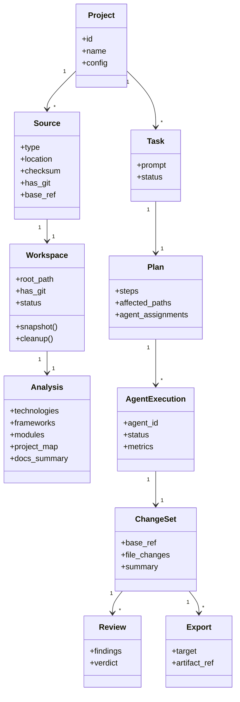
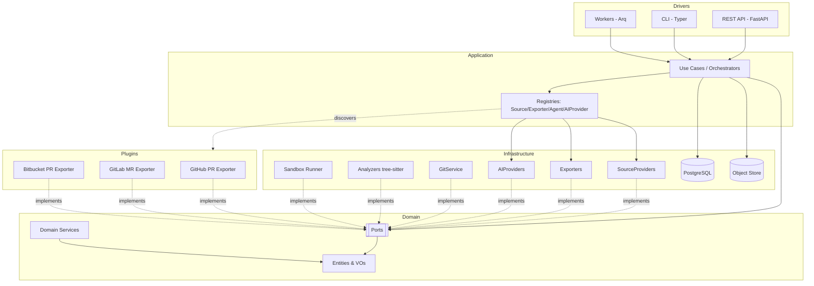
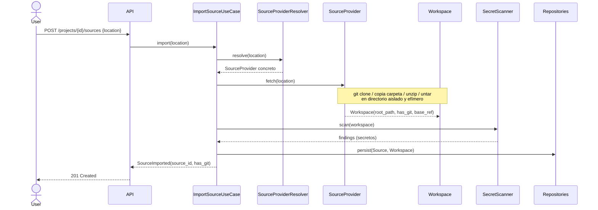
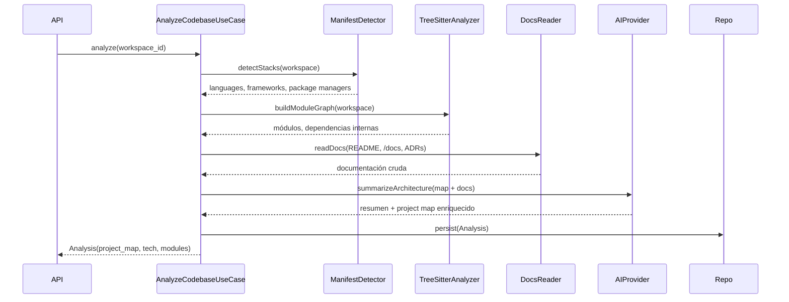
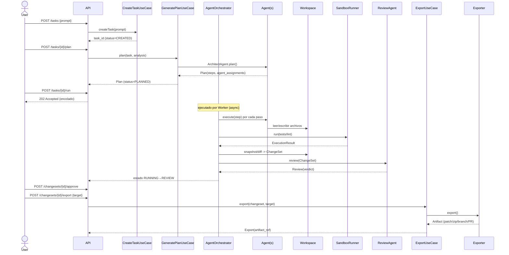

# Codebase Architect — Software Design Document (SDD)

> Estado: **PROPUESTA DE DISEÑO — PENDIENTE DE APROBACIÓN**
> No contiene código de implementación. Una vez aprobado, se implementará por fases con commits pequeños.
> Autor: Arquitectura. Fecha: 2026-06-26.

---

## 0. Resumen ejecutivo

**Codebase Architect** es un agente autónomo que analiza, planifica e implementa cambios sobre **cualquier** codebase, sin acoplarse a ningún proveedor de hosting (GitHub/GitLab/Bitbucket).

El núcleo solo entiende abstracciones puras: `SourceProvider`, `Workspace`, `Task`, `Plan`, `Agent`, `ChangeSet`, `Review`, `Exporter`, `AIProvider`, `GitService`. Todo lo concreto (un repo Git, un zip, Claude, OpenAI, un PR de GitHub) vive como **adaptador/plugin** en la periferia.

Principio rector: **el código fuente es solo bytes en un Workspace**. Da igual si vino de un `git clone`, de un `.zip` o de una carpeta. Git es una *capacidad opcional* del workspace, no un requisito.

Decisiones clave:
- **Arquitectura hexagonal** (puertos y adaptadores) estricta.
- **Stack: Python 3.12** (FastAPI + Typer + Arq + SQLAlchemy/Postgres). Justificación en §3.
- **Plugins descubiertos por entry points**, aislados del núcleo por contrato.
- **AIProvider** desacoplado: Claude, OpenAI, Gemini, OpenRouter, Local son adaptadores intercambiables.
- **Workspaces aislados y efímeros** por ejecución; cada cambio se materializa como `ChangeSet` exportable a patch/zip/rama/PR.

---

## 1. Análisis de requisitos

### 1.1 Requisitos funcionales (RF)

| ID | Requisito | Prioridad |
|----|-----------|-----------|
| RF-01 | Importar proyecto desde repo Git remoto | Must |
| RF-02 | Importar desde repo Git local | Must |
| RF-03 | Importar desde carpeta local | Must |
| RF-04 | Importar desde `.zip` | Must |
| RF-05 | Importar desde `.tar.gz` | Must |
| RF-06 | Crear un Workspace aislado por importación/ejecución | Must |
| RF-07 | Analizar arquitectura (detectar capas, módulos, dependencias) | Must |
| RF-08 | Detectar tecnologías, frameworks y lenguajes | Must |
| RF-09 | Leer y resumir documentación existente (README, /docs, ADRs) | Should |
| RF-10 | Generar un *project map* (mapa estructural navegable) | Must |
| RF-11 | Recibir tarea en lenguaje natural | Must |
| RF-12 | Generar un plan de implementación estructurado | Must |
| RF-13 | Ejecutar agentes especializados sobre el plan | Must |
| RF-14 | Modificar el código dentro del Workspace | Must |
| RF-15 | Ejecutar tests / comandos de verificación | Should |
| RF-16 | Generar diff/ChangeSet del trabajo realizado | Must |
| RF-17 | Crear commits si el origen es Git | Must |
| RF-18 | Exportar resultado como patch, zip o rama | Must |
| RF-19 | Abrir PR/MR solo si hay plugin de hosting configurado | Could |
| RF-20 | Consultar estado de proyectos, tareas y ejecuciones | Must |
| RF-21 | Revisar y aprobar/rechazar cambios (human-in-the-loop) | Should |
| RF-22 | API REST y CLI equivalentes funcionalmente | Must |
| RF-23 | Persistir proyectos, fuentes, workspaces, análisis, tareas, planes, ejecuciones, cambios, logs, métricas y configuración | Must |
| RF-24 | Sistema de agentes extensible (registro/plug de nuevos agentes) | Must |
| RF-25 | AIProvider intercambiable en runtime/config | Must |

### 1.2 Requisitos no funcionales (RNF)

| ID | Requisito |
|----|-----------|
| RNF-01 | **Desacoplamiento**: el dominio no importa nada de infraestructura ni de hosting. Verificable con tests de arquitectura (import-linter). |
| RNF-02 | **Extensibilidad**: añadir un SourceProvider/Exporter/Agent/AIProvider no requiere tocar el núcleo. |
| RNF-03 | **Aislamiento y seguridad**: el código importado es *no confiable*; ejecución de tests en sandbox. |
| RNF-04 | **Idempotencia/reanudabilidad** de ejecuciones largas (workers, reintentos). |
| RNF-05 | **Observabilidad**: logs estructurados, métricas (tokens, coste, duración), trazas por ejecución. |
| RNF-06 | **Determinismo de artefactos**: un ChangeSet siempre puede reexportarse a cualquier formato. |
| RNF-07 | **Portabilidad**: funciona sin Git instalado para fuentes no-Git. |
| RNF-08 | **Coste controlado**: límites de tokens/coste por tarea, presupuesto configurable. |
| RNF-09 | **Multi-tenant ready** (aislar datos por proyecto/usuario), aunque MVP sea single-tenant. |

### 1.3 Fuera de alcance (MVP)
- UI web propia (se consume vía API).
- Ejecución distribuida multi-nodo (se diseña, no se implementa en fase 1).
- Plugins de hosting reales (solo se prepara el contrato; GitHub llega como plugin posterior).

### 1.4 Actores
- **Usuario/Dev** (vía CLI o API).
- **Orquestador** (Application services).
- **Agentes IA** (autónomos, supervisados).
- **Sistemas externos opcionales**: proveedores de IA, hosting Git (plugins).

---

## 2. Riesgos técnicos

| ID | Riesgo | Impacto | Prob. | Mitigación |
|----|--------|---------|-------|------------|
| R-01 | Ejecutar código/tests de un repo no confiable compromete el host | Alto | Media | Sandbox (contenedor efímero, sin red, FS limitado, timeouts, ulimits). Ejecución desactivable. |
| R-02 | Acoplamiento accidental del núcleo a Git/hosting/IA | Alto | Media | Arquitectura hexagonal + import-linter en CI + revisión de PRs. |
| R-03 | Costes de IA descontrolados | Alto | Alta | Presupuesto por tarea, contadores de tokens, caché de prompts, modelos por capacidad. |
| R-04 | Cambios del agente que rompen el build silenciosamente | Alto | Alta | Gate de verificación (tests/lint) antes de aceptar ChangeSet; ReviewAgent + aprobación humana. |
| R-05 | Análisis poco fiable en codebases enormes (límite de contexto) | Medio | Alta | Análisis incremental/jerárquico, RAG sobre el código, mapa por módulos, chunking. |
| R-06 | Pérdida de trabajo por workspaces efímeros | Medio | Media | Persistir ChangeSet/patch antes de limpiar workspace; export atómico. |
| R-07 | Diferencias entre ecosistemas (JVM/Gradle vs npm vs CocoaPods…) | Medio | Alta | Detectores por ecosistema como adaptadores; degradar con elegancia si falta toolchain. |
| R-08 | Diff/merge conflictivos al reexportar a Git | Medio | Media | Generar patch contra el commit base capturado en import; 3-way merge controlado. |
| R-09 | Lock-in a un proveedor de IA | Medio | Media | Puerto `AIProvider` + capacidades declarativas; tests de contrato por adaptador. |
| R-10 | Crecimiento descontrolado de plugins de baja calidad | Bajo | Media | Contrato versionado de plugin + suite de conformidad obligatoria. |
| R-11 | Datos sensibles/secretos en el código importado | Alto | Media | Scan de secretos en import; no enviar a IA sin redacción configurable. |
| R-12 | Ejecuciones largas que exceden timeouts HTTP | Medio | Alta | Modelo asíncrono: API encola, workers ejecutan, estado por polling/eventos. |

---

## 3. Propuesta de stack

### 3.1 Lenguaje del núcleo: **Python 3.12**

Razones:
- Ecosistema IA de primera (SDKs oficiales Anthropic/OpenAI/Google, OpenRouter HTTP, llama.cpp/Ollama local).
- Modelado de dominio expresivo con `dataclasses`/Pydantic.
- FastAPI (API), Typer (CLI), Arq/Celery (workers) maduros.
- Tooling de tests de arquitectura (import-linter) para garantizar el hexágono.

Alternativa considerada: **TypeScript/Node** (buen tooling, SDKs IA decentes) — descartada como núcleo por menor madurez de workers/datos; queda como opción para SDK cliente.

### 3.2 Stack por capa

| Capa | Tecnología | Notas |
|------|-----------|-------|
| Lenguaje | Python 3.12 | tipado estricto (mypy) |
| Dominio | dataclasses puras + Pydantic v2 (DTOs en bordes) | sin dependencias de infra |
| API | FastAPI + Uvicorn | OpenAPI auto, async |
| CLI | Typer (Click) + Rich | salida legible |
| Workers | Arq (Redis) | colas async; Celery como alternativa |
| Cola/Broker | Redis | jobs + pub/sub de eventos |
| Persistencia | PostgreSQL + SQLAlchemy 2.0 + Alembic | JSONB para análisis/planes |
| Object storage | FS local (MVP) → S3-compatible | artefactos: zips, patches, logs |
| IA | SDKs por adaptador | Claude/OpenAI/Gemini/OpenRouter/Local |
| Git | `pygit2` (libgit2) o CLI `git` vía adaptador | opcional |
| Análisis código | tree-sitter (multi-lenguaje) + detectores por manifiesto | AST ligero |
| Sandbox | Docker / contenedor efímero | ejecución de tests aislada |
| Plugins | `importlib.metadata` entry points | descubrimiento dinámico |
| Config | Pydantic Settings (env + archivo) | 12-factor |
| Observabilidad | structlog + OpenTelemetry + Prometheus | logs/trazas/métricas |
| Tests | pytest + import-linter + testcontainers | unit/contract/arch/e2e |
| Empaquetado | uv/pip + pyproject + Docker | mono-repo Python |

### 3.3 Capacidades opcionales degradables
- Sin Git instalado → fuentes Git remotas/locales se deshabilitan, el resto funciona.
- Sin Docker → ejecución de tests deshabilitada (solo análisis y diff).
- Sin plugin de hosting → export limitado a patch/zip/rama local.

---

## 4. Arquitectura completa (hexagonal)

### 4.1 Capas y reglas de dependencia

```
            ┌──────────────────────────────────────────────┐
            │                  DRIVERS (in)                 │
            │   API (FastAPI)   CLI (Typer)   Workers       │
            └───────────────┬──────────────────────────────┘
                            │ llaman casos de uso
            ┌───────────────▼──────────────────────────────┐
            │               APPLICATION                     │
            │  Use cases / Orchestrators / Ports (in/out)   │
            └───────────────┬──────────────────────────────┘
                            │ usa solo Domain + Ports
            ┌───────────────▼──────────────────────────────┐
            │                 DOMAIN                         │
            │  Entities · Value Objects · Domain Services    │
            │  Ports (interfaces): SourceProvider, Workspace,│
            │  AIProvider, GitService, Exporter, Agent, Repo │
            └───────────────▲──────────────────────────────┘
                            │ implementan puertos
            ┌───────────────┴──────────────────────────────┐
            │             INFRASTRUCTURE (out)              │
            │ Git, FS, Zip, TarGz, DB repos, AI SDKs,       │
            │ Sandbox, ObjectStore, tree-sitter analyzers   │
            └───────────────┬──────────────────────────────┘
                            │ contrato de plugin
            ┌───────────────▼──────────────────────────────┐
            │                  PLUGINS                       │
            │ GitHub / GitLab / Bitbucket exporters, etc.   │
            └──────────────────────────────────────────────┘
                  SHARED: config, logging, errors, ids, types
```

**Regla de oro:** las dependencias apuntan **hacia dentro**. `Domain` no importa nada de `Application`/`Infrastructure`/`API`. `Infrastructure` implementa puertos definidos en `Domain`. Validado por **import-linter** en CI.

### 4.2 Puertos principales (interfaces del dominio)

```text
SourceProvider        : fetch(SourceLocation) -> Workspace
Workspace             : root_path, has_git, read/write/list, snapshot(), cleanup()
Analyzer (port)       : analyze(Workspace) -> Analysis
AIProvider            : complete(prompt, opts) / chat(messages) ; capabilities()
GitService            : clone, status, diff, branch, checkout, commit, merge, push  (opcional)
Agent                 : id, capabilities, execute(AgentContext) -> AgentResult
Planner (port)        : plan(Task, Analysis) -> Plan
Exporter              : export(ChangeSet, target) -> Artifact
SandboxRunner (port)  : run(command, Workspace) -> ExecutionResult
SecretScanner (port)  : scan(Workspace) -> list[Finding]
Repository<T> (ports) : persistencia por agregado
EventBus (port)       : publish/subscribe (estado de ejecuciones)
```

### 4.3 Adaptadores (infraestructura) que implementan los puertos

| Puerto | Adaptadores |
|--------|-------------|
| SourceProvider | `GitRemoteSourceProvider`, `LocalGitSourceProvider`, `LocalFolderSourceProvider`, `ZipSourceProvider`, `TarGzSourceProvider` |
| Exporter | `GitCommitExporter`, `PatchExporter`, `ZipExporter`, `FolderExporter` (+ plugins: `GitHubPullRequestExporter`, `GitLabMergeRequestExporter`, `BitbucketPullRequestExporter`) |
| AIProvider | `ClaudeProvider`, `OpenAIProvider`, `GeminiProvider`, `OpenRouterProvider`, `LocalProvider` |
| GitService | `LibGit2GitService` / `CliGitService` |
| Analyzer | `TreeSitterAnalyzer`, `ManifestDetector` (npm/pip/gradle/cocoapods/go.mod…), `DocsReader` |
| SandboxRunner | `DockerSandboxRunner`, `NullSandboxRunner` |
| Repository | `SqlAlchemy*Repository` |

### 4.4 Selección de adaptadores (Factories + Registry)
- **SourceProviderResolver**: dado un `SourceLocation` (URL git, ruta, .zip, .tar.gz) elige el provider por *content sniffing* + esquema.
- **ExporterRegistry / AgentRegistry / AIProviderRegistry**: registran adaptadores nativos + plugins por entry points. Selección por configuración o por capacidades requeridas.

---

## 5. Modelo de dominio

### 5.1 Agregados y entidades

- **Project** *(raíz)*: agrupa fuentes, análisis, tareas. `id, name, config, created_at`.
- **Source**: descripción de la importación. `type(GIT_REMOTE|LOCAL_GIT|FOLDER|ZIP|TARGZ), location, checksum, has_git, base_ref?`.
- **Workspace**: directorio aislado materializado de una Source. `id, source_id, root_path, has_git, status, ttl`.
- **Analysis**: resultado del análisis. `technologies[], frameworks[], languages[], modules[], dependencies[], project_map, docs_summary, metrics`.
- **Task**: petición en lenguaje natural. `id, project_id, prompt, constraints, status`.
- **Plan**: `id, task_id, steps[], affected_paths[], agent_assignments[], risk, est_tokens`.
- **AgentExecution (Run)**: ejecución de un agente/plan. `id, plan_id, agent_id, status, logs, metrics(tokens,cost,duration)`.
- **ChangeSet**: conjunto de cambios. `id, run_id, base_ref, file_changes[](path, op, diff_hunks), summary`.
- **Review**: `id, changeset_id, findings[], verdict(APPROVED|REJECTED|CHANGES_REQUESTED), reviewer(human|ReviewAgent)`.
- **Export**: `id, changeset_id, target(PATCH|ZIP|FOLDER|GIT_BRANCH|PR), artifact_ref, status`.

### 5.2 Value Objects
`SourceLocation`, `TechStack`, `Module`, `Dependency`, `ProjectMap`, `FileChange`, `DiffHunk`, `Capability`, `TokenUsage`, `Budget`, `ExecutionResult`, `Finding`, `Artifact`.

### 5.3 Máquina de estados (Task / Run)

```
Task:   CREATED → ANALYZED → PLANNED → RUNNING → REVIEW → APPROVED → EXPORTED
                                   ↘ FAILED        ↘ REJECTED → (replan)
Run:    QUEUED → RUNNING → VERIFYING → DONE | FAILED | CANCELLED
```

### 5.4 Invariantes
- Un `ChangeSet` siempre referencia un `base_ref` (commit, o checksum del snapshot para fuentes no-Git).
- No se exporta a `GIT_BRANCH`/`PR` si `Workspace.has_git == false`.
- `Export` a `PR` requiere un plugin de hosting registrado y configurado.
- Toda mutación de código ocurre dentro de un `Workspace` aislado, nunca sobre la Source original.

### 5.5 Diagrama de clases (dominio)



---

## 6. Diagrama Mermaid (componentes / contexto)



---

## 7. Flujo de importación



Notas:
- El **Resolver** decide el provider: esquema `git@`/`https://…git` → Git remoto; ruta con `.git` → Git local; ruta dir → carpeta; magic bytes `PK` → zip; `gzip` → tar.gz.
- `base_ref`: commit HEAD si hay Git; si no, checksum del árbol (snapshot).
- El workspace nunca es la fuente original: siempre copia/clon aislado.

---

## 8. Flujo de análisis



Estrategia para codebases grandes: detección determinista primero (manifiestos + tree-sitter, sin IA), luego resumen jerárquico por módulo con IA (map-reduce) para no saturar el contexto.

---

## 9. Flujo de ejecución (tarea → plan → cambios → export)



Reglas:
- `run` es **asíncrono** (workers). La API responde 202 y el estado se consulta por polling/eventos.
- Verificación (tests/lint) es un **gate**: si falla, el ChangeSet se marca y el ReviewAgent lo refleja.
- Aprobación humana opcional según política del proyecto (auto-approve configurable).

---

## 10. Diseño de plugins

### 10.1 Contrato
Un plugin es un paquete Python que se registra vía **entry points** y expone implementaciones de puertos del dominio. Categorías: `source_provider`, `exporter`, `ai_provider`, `agent`, `analyzer`.

```toml
# pyproject.toml de un plugin
[project.entry-points."codebase_architect.exporters"]
github_pr = "ca_plugin_github:GitHubPullRequestExporter"
```

### 10.2 Ciclo de vida
1. **Descubrimiento**: al arrancar, los Registries leen entry points por categoría.
2. **Validación de contrato**: cada plugin debe pasar la *conformance suite* (tests de contrato del puerto) — si no, se carga en modo degradado/deshabilitado.
3. **Configuración**: credenciales/políticas vía settings con namespace (`plugins.github.token`).
4. **Aislamiento**: el plugin solo ve puertos y VOs del dominio; nunca el `Application`/DB directamente.

### 10.3 Versionado
- Contrato de puerto versionado (`PortVersion`). El loader rechaza plugins incompatibles.
- Plugins de hosting (GitHub/GitLab/Bitbucket) reciben un `ChangeSet` ya exportado a rama Git y solo crean el PR/MR sobre el remoto correspondiente.

### 10.4 Mapa de plugins previstos
| Plugin | Categoría | Estado |
|--------|-----------|--------|
| GitHubPullRequestExporter | exporter | futuro |
| GitLabMergeRequestExporter | exporter | futuro |
| BitbucketPullRequestExporter | exporter | futuro |
| (extensible) AndroidLintAgent, etc. | agent | futuro |

---

## 11. Diseño de persistencia

### 11.1 Motor
PostgreSQL (relacional + JSONB para estructuras semi-flexibles: análisis, planes, métricas). Object store (FS→S3) para artefactos binarios (zips, patches, logs grandes).

### 11.2 Esquema (tablas principales)

```
projects(id, name, config jsonb, created_at)
sources(id, project_id, type, location, checksum, has_git, base_ref, created_at)
workspaces(id, source_id, root_path, has_git, status, ttl, created_at)
analyses(id, workspace_id, technologies jsonb, frameworks jsonb, modules jsonb,
         project_map jsonb, docs_summary text, metrics jsonb, created_at)
tasks(id, project_id, prompt, constraints jsonb, status, created_at)
plans(id, task_id, steps jsonb, affected_paths jsonb, agent_assignments jsonb,
      risk, est_tokens, created_at)
agent_executions(id, plan_id, agent_id, status, started_at, finished_at, metrics jsonb)
changesets(id, run_id, base_ref, summary, created_at)
file_changes(id, changeset_id, path, op, diff text)        -- diff grande -> object store ref
reviews(id, changeset_id, verdict, findings jsonb, reviewer, created_at)
exports(id, changeset_id, target, artifact_ref, status, created_at)
logs(id, run_id, level, message, ts, context jsonb)        -- o sink externo
metrics(id, scope_type, scope_id, name, value, ts)
configurations(id, scope_type, scope_id, key, value jsonb)
```

### 11.3 Patrón
- **Repository por agregado** (puertos en dominio, SQLAlchemy en infra).
- **Unit of Work** para transacciones que cruzan agregados.
- Artefactos voluminosos → referencia en object store, no en DB.
- Migraciones con **Alembic**.

### 11.4 Retención
- Workspaces efímeros con TTL; el ChangeSet/patch se persiste **antes** de limpiar.
- Logs/métricas con política de retención configurable.

---

## 12. Estructura de carpetas

```
codebase-architect/
├── pyproject.toml
├── docker-compose.yml
├── docs/
│   ├── SDD.md
│   └── adr/
├── src/codebase_architect/
│   ├── domain/                # SIN dependencias externas
│   │   ├── model/             # Project, Source, Workspace, Task, Plan, ChangeSet...
│   │   ├── ports/             # SourceProvider, AIProvider, Exporter, GitService, Agent, Repo...
│   │   ├── services/          # domain services (reglas puras)
│   │   └── events/            # eventos de dominio
│   ├── application/
│   │   ├── use_cases/         # import, analyze, create_task, plan, run, export, review
│   │   ├── orchestration/     # AgentOrchestrator
│   │   ├── registries/        # Source/Exporter/Agent/AIProvider registries + resolver
│   │   └── dto/
│   ├── infrastructure/
│   │   ├── source_providers/  # git_remote, local_git, folder, zip, targz
│   │   ├── exporters/         # git_commit, patch, zip, folder
│   │   ├── ai_providers/      # claude, openai, gemini, openrouter, local
│   │   ├── git/               # libgit2/cli GitService
│   │   ├── analysis/          # tree-sitter, manifest detectors, docs reader, secret scanner
│   │   ├── sandbox/           # docker runner, null runner
│   │   ├── persistence/       # sqlalchemy models, repositories, uow, alembic
│   │   ├── objectstore/
│   │   └── eventbus/          # redis pub/sub
│   ├── agents/                # ArchitectAgent, Backend, Android, iOS, Web, QA, Security, Docs, Review
│   ├── api/                   # FastAPI routers, schemas, deps
│   ├── workers/               # Arq tasks
│   ├── cli/                   # Typer commands
│   └── shared/                # config, logging, errors, ids, types, telemetry
├── plugins/                   # plugins externos (paquetes separados)
│   ├── github/
│   ├── gitlab/
│   └── bitbucket/
└── tests/
    ├── unit/
    ├── contract/              # conformance de puertos/plugins
    ├── architecture/          # import-linter
    ├── integration/           # testcontainers (pg/redis)
    └── e2e/
```

---

## 13. Roadmap por fases

| Fase | Objetivo | Entregable verificable |
|------|----------|------------------------|
| **F0 — Cimientos** | Repo, pyproject, hexágono vacío, import-linter, CI, config/logging | `make test` verde; arch tests pasan |
| **F1 — Importación** | `SourceProvider` + 5 adaptadores + Workspace + persistencia mínima + CLI `import` | Importar git/folder/zip/tar.gz a workspace aislado |
| **F2 — Análisis** | Analyzers (manifest + tree-sitter) + DocsReader + project map + `analyze` | Generar Analysis para repos de prueba multi-lenguaje |
| **F3 — IA & Plan** | `AIProvider` (Claude primero) + ArchitectAgent + GeneratePlan + `task`/`plan` | Plan estructurado a partir de prompt NL |
| **F4 — Ejecución** | AgentOrchestrator + agentes base + edición en workspace + ChangeSet + `run`/`diff` | ChangeSet real con diff sobre repo de prueba |
| **F5 — Verificación & Review** | SandboxRunner (Docker) + QA/ReviewAgent + gate de tests | Tests ejecutados en sandbox; veredicto de review |
| **F6 — Export** | Exporters patch/zip/folder/git-commit + `export` | Artefactos descargables; rama Git local |
| **F7 — API completa & Workers** | API REST completa async + Arq + estados/eventos | Flujo extremo a extremo vía API |
| **F8 — Multi-IA & Plugins** | OpenAI/Gemini/OpenRouter/Local + contrato de plugin + conformance | Cambiar de proveedor por config; plugin de ejemplo |
| **F9 — Hosting plugins** | GitHub/GitLab/Bitbucket PR/MR exporters (fuera del núcleo) | Abrir PR vía plugin configurado |
| **F10 — Hardening** | Seguridad, secret scanning, presupuestos, métricas, docs | Límites de coste, scan de secretos, dashboards |

Cada fase = una o varias épicas, con commits pequeños y coherentes.

---

## 14. Épicas y tareas pequeñas

### Épica F0 — Cimientos
- [ ] Inicializar `pyproject.toml`, layout `src/`, herramientas (ruff, mypy, pytest).
- [ ] Configurar `import-linter` con contratos de capa (domain no importa infra).
- [ ] `shared`: config (Pydantic Settings), logging estructurado, errores base, generador de ids.
- [ ] CI (lint + type + tests + arch).
- [ ] `docker-compose` con Postgres y Redis para dev.

### Épica F1 — Importación
- [ ] Definir puertos `SourceProvider` y `Workspace` en dominio.
- [ ] VO `SourceLocation` + `SourceProviderResolver` (sniffing).
- [ ] Adaptador `LocalFolderSourceProvider`.
- [ ] Adaptador `ZipSourceProvider`.
- [ ] Adaptador `TarGzSourceProvider`.
- [ ] Adaptador `LocalGitSourceProvider`.
- [ ] Adaptador `GitRemoteSourceProvider` (degradable si no hay git).
- [ ] `ImportSourceUseCase` + repos `Source`/`Workspace`.
- [ ] CLI `architect import`.
- [ ] Tests de contrato `SourceProvider` (mismo set para los 5 adaptadores).

### Épica F2 — Análisis
- [ ] Puerto `Analyzer` + VOs `TechStack`/`Module`/`ProjectMap`.
- [ ] `ManifestDetector` (npm, pip/poetry, gradle/maven, cocoapods/spm, go.mod, cargo…).
- [ ] `TreeSitterAnalyzer` (grafo de módulos/símbolos).
- [ ] `DocsReader` (README/docs/ADR).
- [ ] `AnalyzeCodebaseUseCase` (determinista + resumen IA opcional).
- [ ] CLI `architect analyze`; persistencia `Analysis`.

### Épica F3 — IA & Plan
- [ ] Puerto `AIProvider` + `Capability` + `TokenUsage`/`Budget`.
- [ ] `ClaudeProvider` (adaptador) + tests de contrato `AIProvider`.
- [ ] Interfaz `Agent` + `ArchitectAgent`.
- [ ] `CreateTaskUseCase` + `GeneratePlanUseCase`.
- [ ] CLI `architect task`, `architect plan`.

### Épica F4 — Ejecución
- [ ] `AgentRegistry` + agentes base (Backend/Web/Docs como mínimos).
- [ ] `AgentOrchestrator` (ejecuta pasos del plan).
- [ ] Edición de workspace + cálculo de `ChangeSet`/diff.
- [ ] CLI `architect run`, `architect diff`; persistencia `AgentExecution`/`ChangeSet`.

### Épica F5 — Verificación & Review
- [ ] Puerto `SandboxRunner` + `DockerSandboxRunner` + `NullSandboxRunner`.
- [ ] `QAAgent` (lanza tests/lint), `ReviewAgent`, `SecurityAgent`.
- [ ] Gate de verificación en el orquestador; entidad `Review`.

### Épica F6 — Export
- [ ] Puerto `Exporter` + `PatchExporter`, `ZipExporter`, `FolderExporter`.
- [ ] `GitCommitExporter` (rama local) usando `GitService`.
- [ ] `ExportUseCase` + CLI `architect export`.

### Épica F7 — API & Workers
- [ ] API REST (endpoints §15.4) con FastAPI.
- [ ] Workers Arq para `run` async + `EventBus` (estado).
- [ ] CLI `architect status` (consulta estados).

### Épica F8 — Multi-IA & Plugins
- [ ] `OpenAIProvider`, `GeminiProvider`, `OpenRouterProvider`, `LocalProvider`.
- [ ] Mecanismo de entry points + conformance suite de plugins.

### Épica F9 — Hosting plugins (fuera del núcleo)
- [ ] `GitHubPullRequestExporter` (plugin).
- [ ] `GitLabMergeRequestExporter`, `BitbucketPullRequestExporter`.

### Épica F10 — Hardening
- [ ] Secret scanning en import; redacción antes de IA.
- [ ] Presupuestos/limites de tokens y coste por tarea.
- [ ] Métricas/observabilidad (OpenTelemetry/Prometheus) y documentación.

---

## 15. SDD — detalle complementario

### 15.1 Interfaces clave (firmas conceptuales, no implementación)

```text
SourceProvider:
    supports(location: SourceLocation) -> bool
    fetch(location: SourceLocation) -> Workspace

Workspace:
    root_path: Path
    has_git: bool
    read(path) / write(path, content) / list(glob) -> ...
    snapshot() -> SnapshotRef
    diff(base: SnapshotRef) -> ChangeSet
    cleanup() -> None

AIProvider:
    capabilities() -> set[Capability]      # chat, tools, vision, long_context...
    complete(prompt, options) -> Completion
    chat(messages, options) -> Completion   # incluye TokenUsage

GitService:                                # opcional
    clone / status / diff / branch / checkout / commit / merge / push

Agent:
    id: str ; capabilities: set[Capability]
    execute(ctx: AgentContext) -> AgentResult   # ctx: workspace, plan_step, ai, tools

Exporter:
    supports(target: ExportTarget) -> bool
    export(changeset: ChangeSet, target: ExportTarget) -> Artifact
```

### 15.2 Sistema de agentes
- Todos implementan la **misma interfaz** `Agent`.
- Catálogo: `ArchitectAgent` (planifica), `BackendAgent`, `AndroidAgent`, `iOSAgent`, `WebAgent`, `QAAgent`, `SecurityAgent`, `DocumentationAgent`, `ReviewAgent`.
- Selección por **capacidades** (el plan asigna agentes a pasos según stack detectado y tipo de paso).
- El orquestador inyecta `AIProvider`, `Workspace` y herramientas (lectura/escritura/búsqueda/sandbox) en `AgentContext`.

### 15.3 CLI (mapa de comandos)

```
architect import   <location> [--project P]      # git/folder/zip/tar.gz
architect analyze  [--source S]
architect task     "<descripción en lenguaje natural>"
architect plan     [--task T]
architect run      [--task T] [--auto-approve]
architect status   [--task T | --run R]
architect diff     [--changeset C]
architect export   [--changeset C] --target patch|zip|folder|branch|pr
```

### 15.4 API REST (endpoints principales)

```
POST   /projects                         crear proyecto
POST   /projects/{id}/sources            importar código (location)
POST   /sources/{id}/analyze             analizar codebase  -> Analysis
GET    /analyses/{id}                    consultar análisis
POST   /projects/{id}/tasks              crear tarea (prompt NL)
POST   /tasks/{id}/plan                  generar plan
POST   /tasks/{id}/run                   ejecutar agentes (202, async)
GET    /tasks/{id}                       estado de la tarea
GET    /runs/{id}                        estado de ejecución
GET    /changesets/{id}                  ver cambios
GET    /changesets/{id}/diff             ver diff
POST   /changesets/{id}/approve          aprobar cambios
POST   /changesets/{id}/export           exportar (target) -> Artifact
GET    /exports/{id}/download            descargar resultado
```

### 15.5 Configuración (extracto)

```yaml
ai:
  default_provider: claude
  budget_per_task_usd: 5.0
providers:
  claude:   { model: claude-..., api_key_env: ANTHROPIC_API_KEY }
  openai:   { model: ...,        api_key_env: OPENAI_API_KEY }
  local:    { endpoint: http://localhost:11434 }
git:
  enabled: true
sandbox:
  enabled: true
  driver: docker
plugins:
  github: { enabled: false }
review:
  require_human_approval: true
```

### 15.6 Tests de arquitectura (garantía del desacoplamiento)
- `domain` no importa `application`, `infrastructure`, `api`, `agents`, `plugins`.
- Ninguna capa importa `plugins` directamente (solo vía Registry).
- Ningún módulo del núcleo importa SDKs de hosting (github/gitlab/bitbucket).
- Contratos verificados con **import-linter** en CI (bloqueante).

---

## Próximo paso

Este documento es la **propuesta de diseño**. No se ha implementado ningún componente.
A la espera de tu **aprobación** (total o con cambios) para comenzar por la **Fase F0 (Cimientos)** con commits pequeños y coherentes.
