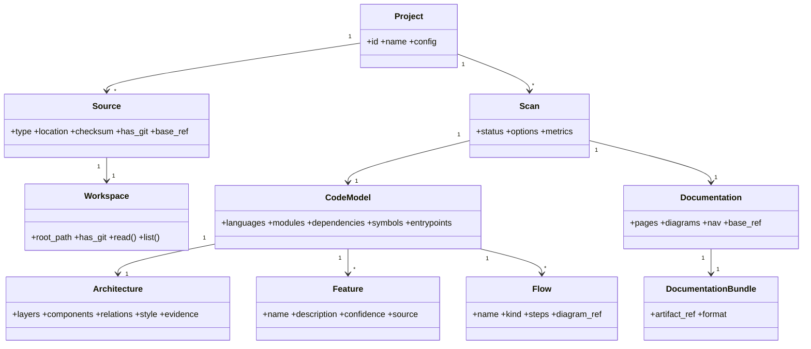
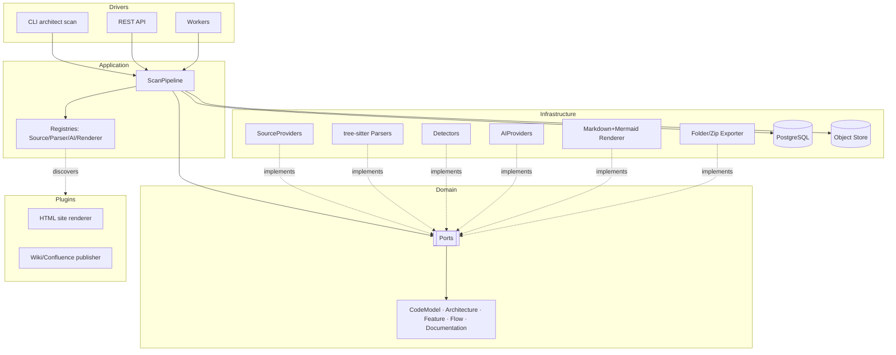
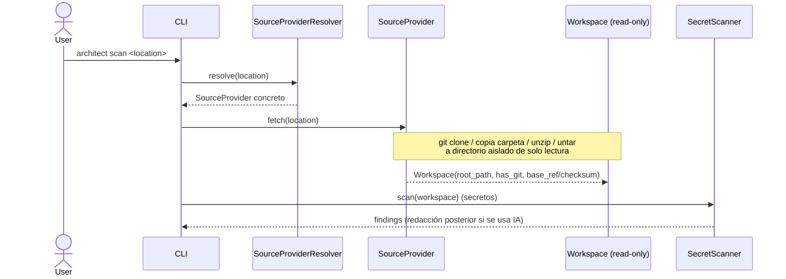
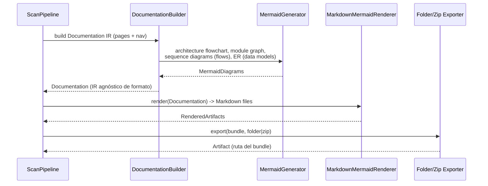

# Codebase Architect — Software Design Document (SDD)

> Estado: **APROBADO — IMPLEMENTADO (F0–F8)**
> El diseño v2 (generador de documentación) está implementado de extremo a extremo:
> CLI + API REST, análisis estático (Java/Kotlin/Angular), narrativa IA opcional
> multi-proveedor, render Markdown/Mermaid (+HTML por plugin), secret scanning y caché.
> Reemplaza a la v1 (que modelaba un agente que *modificaba* código). Fecha: 2026-06-27.
> Guía de uso: `docs/USAGE.md`. Guía para contribuir/IA: `CLAUDE.md`.

---

## 0. Resumen ejecutivo

**Codebase Architect** es una herramienta que, **lanzando un único escaneo** sobre cualquier
codebase, genera **documentación limpia** de su **arquitectura, funcionalidades y flujos** en
**Markdown + Mermaid**.

Es una herramienta de **solo lectura / comprensión de código**: nunca modifica el proyecto
analizado. No abre PRs, no hace commits, no edita ficheros del codebase.

Decisiones aprobadas:
- **Salida:** Markdown + diagramas Mermaid (versionable en el propio repo). El modelo de
  documentación es agnóstico del renderer, dejando la puerta a un sitio HTML estático como
  renderer/plugin futuro.
- **Análisis híbrido:** una fase **estática/determinista** (lenguajes, manifiestos, módulos,
  dependencias, grafos, entrypoints) y una fase **de IA** que redacta funcionalidades y flujos
  en lenguaje natural, **anclada a los hechos estáticos** para minimizar alucinaciones.
- **Entrada multi-fuente:** git remoto, git local, carpeta, `.zip`, `.tar.gz`.
- **No acoplado** a GitHub/GitLab/Bitbucket ni a un proveedor de IA concreto.

El corazón del sistema es un **pipeline de escaneo**:

```
scan = import → discover → parse → model → infer → narrate(IA) → render(MD+Mermaid) → write
```

---

## 1. Análisis de requisitos

### 1.1 Requisitos funcionales (RF)

| ID | Requisito | Prioridad |
|----|-----------|-----------|
| RF-01 | Importar codebase desde git remoto, git local, carpeta, `.zip`, `.tar.gz` | Must |
| RF-02 | Materializar la fuente en un Workspace **de solo lectura** y aislado | Must |
| RF-03 | Detectar lenguajes, gestores de paquetes, frameworks y manifiestos | Must |
| RF-04 | Parsear el código (multi-lenguaje) y extraer símbolos (clases, funciones, módulos) | Must |
| RF-05 | Construir el grafo de módulos internos y el de dependencias externas | Must |
| RF-06 | Detectar entrypoints (main, rutas HTTP, comandos CLI, jobs) | Should |
| RF-07 | Inferir arquitectura: capas, componentes y sus relaciones | Must |
| RF-08 | Leer y resumir documentación existente (README, /docs, ADRs) | Should |
| RF-09 | Catalogar **funcionalidades** del sistema en lenguaje natural (IA) | Must |
| RF-10 | Extraer y describir **flujos** (secuencias/cadenas de llamadas) | Must |
| RF-11 | Generar documentación en **Markdown + Mermaid** (arquitectura, módulos, deps, features, flujos) | Must |
| RF-12 | Escribir el bundle de docs a carpeta y/o `.zip` | Must |
| RF-13 | Ejecutar todo con **un solo comando** (`architect scan <fuente>`) | Must |
| RF-14 | Permitir análisis **solo estático** (sin IA) de forma degradada | Should |
| RF-15 | Consultar estado de un escaneo y descargar su resultado (API) | Must |
| RF-16 | AIProvider intercambiable (Claude/OpenAI/Gemini/OpenRouter/Local) | Must |
| RF-17 | Re-escanear un proyecto y regenerar documentación (idempotente) | Should |

### 1.2 Requisitos no funcionales (RNF)

| ID | Requisito |
|----|-----------|
| RNF-01 | **Solo lectura**: nunca se escribe sobre el codebase analizado. |
| RNF-02 | **Desacoplamiento**: el dominio no conoce IA, git hosting ni el formato de salida (verificado por import-linter). |
| RNF-03 | **Extensibilidad**: añadir un SourceProvider, un analizador, un AIProvider o un renderer no toca el núcleo. |
| RNF-04 | **Escalabilidad de contexto**: la IA trabaja por *map-reduce* sobre el modelo estático; no se vuelca todo el repo al prompt. |
| RNF-05 | **Reproducibilidad**: la fase estática es determinista; la documentación incluye qué se infirió vs qué redactó la IA. |
| RNF-06 | **Coste controlado**: presupuesto de tokens por escaneo; caché de resúmenes. |
| RNF-07 | **Portabilidad/degradación**: funciona sin git (para zip/carpeta) y sin IA (modo estático). |
| RNF-08 | **Observabilidad**: logs estructurados, métricas (ficheros, módulos, tokens, duración). |
| RNF-09 | **Multi-lenguaje** con cobertura incremental por adaptadores (tree-sitter). |

### 1.3 Fuera de alcance
- Modificar/refactorizar el código analizado, generar parches, abrir PRs, ejecutar tests del proyecto.
- UI web propia (se consume por CLI/API; el HTML estático es un renderer futuro).
- Análisis dinámico en runtime (solo análisis estático + IA sobre el código).

### 1.4 Actores
- **Dev/Usuario** que lanza un escaneo (CLI o API).
- **Pipeline de escaneo** (orquestación).
- **Proveedor de IA** (opcional, para la narrativa).
- **Sistemas externos opcionales** (plugins futuros: publicar docs en wiki/Confluence).

---

## 2. Riesgos técnicos

| ID | Riesgo | Impacto | Prob. | Mitigación |
|----|--------|---------|-------|------------|
| R-01 | La IA **alucina** funcionalidades/flujos inexistentes | Alto | Alta | Anclar la IA a hechos estáticos (símbolos, grafos reales); citar ficheros/símbolos; marcar secciones "inferidas". |
| R-02 | Inferencia de arquitectura **poco fiable** | Alto | Alta | Heurísticas explicables (estructura de carpetas + clustering de dependencias) revisables; mostrar evidencia. |
| R-03 | Repos enormes exceden el contexto de la IA | Medio | Alta | Map-reduce jerárquico por módulo; resumen incremental; límites configurables. |
| R-04 | Cobertura desigual entre lenguajes/frameworks | Medio | Alta | Analizadores por lenguaje como adaptadores; degradar a métricas genéricas si falta soporte. |
| R-05 | Coste de IA descontrolado en repos grandes | Alto | Media | Presupuesto por escaneo, caché por hash de fichero/módulo, modo solo-estático. |
| R-06 | Secretos del código enviados a la IA | Alto | Media | Scan de secretos + redacción antes de enviar; opción de no enviar contenido sensible. |
| R-07 | Acoplamiento accidental del núcleo a IA/hosting/formato | Alto | Media | Hexagonal + import-linter en CI (bloqueante). |
| R-08 | Documentación que queda desactualizada | Medio | Alta | Re-escaneo idempotente; registrar `base_ref`/commit y fecha en la doc generada. |
| R-09 | Escaneos largos exceden timeouts HTTP | Medio | Media | API asíncrona: encola escaneo, workers ejecutan, estado por polling/eventos. |

---

## 3. Propuesta de stack

### 3.1 Lenguaje del núcleo: **Python 3.11+**

Razones: ecosistema IA de primera (SDKs Anthropic/OpenAI/Google, OpenRouter, local), bindings
**tree-sitter** multi-lenguaje, FastAPI/Typer/Arq maduros, modelado expresivo y tests de
arquitectura (import-linter).

### 3.2 Stack por capa

| Capa | Tecnología | Notas |
|------|-----------|-------|
| Lenguaje | Python 3.11+ (mypy strict) | |
| Dominio | dataclasses puras + Pydantic v2 en bordes | sin dependencias de infra |
| Análisis estático | **tree-sitter** (multi-lenguaje) + detectores de manifiestos | AST ligero, grafos |
| IA (narrativa) | SDKs por adaptador | Claude/OpenAI/Gemini/OpenRouter/Local |
| Render | Plantillas Markdown + generador de Mermaid | modelo de doc agnóstico del renderer |
| CLI | Typer + Rich | comando `scan` one-shot |
| API | FastAPI + Uvicorn | escaneos async |
| Workers | Arq (Redis) | escaneos largos |
| Persistencia | PostgreSQL + SQLAlchemy 2.0 + Alembic (JSONB) | scans, modelos, métricas |
| Object store | FS local (MVP) → S3-compatible | bundles de docs, logs |
| Git (opcional) | `pygit2`/CLI vía adaptador | solo clone/checkout/metadata para importar |
| Sniffing fuente | magic bytes + esquema URL | elegir SourceProvider |
| Plugins | entry points (`importlib.metadata`) | renderers, analizadores, publishers |
| Config | Pydantic Settings | 12-factor |
| Observabilidad | structlog + OpenTelemetry/Prometheus | |
| Tests | pytest + import-linter + (testcontainers en integración) | unit/contract/arch |

### 3.3 Capacidades degradables
- Sin git → fuentes git deshabilitadas; carpeta/zip/tar.gz funcionan.
- Sin IA/API key → modo **solo estático** (arquitectura, módulos, deps, grafos; sin narrativa).
- Sin Postgres/Redis → modo CLI one-shot con persistencia en ficheros (MVP local).

---

## 4. Arquitectura (hexagonal)

### 4.1 Capas y regla de dependencia

```
        ┌──────────────────────────────────────────────┐
        │                  DRIVERS (in)                 │
        │      CLI (Typer)   API (FastAPI)   Workers     │
        └───────────────┬──────────────────────────────┘
        ┌───────────────▼──────────────────────────────┐
        │               APPLICATION                     │
        │  ScanPipeline / Use cases / Registries        │
        └───────────────┬──────────────────────────────┘
        ┌───────────────▼──────────────────────────────┐
        │                 DOMAIN                         │
        │  Model (CodeModel, Architecture, Feature,     │
        │  Flow, Documentation) · Ports · Services       │
        └───────────────▲──────────────────────────────┘
        ┌───────────────┴──────────────────────────────┐
        │             INFRASTRUCTURE (out)              │
        │ SourceProviders · Parsers(tree-sitter) ·      │
        │ Detectors · AIProviders · Renderers ·         │
        │ Exporters · Repos · ObjectStore               │
        └───────────────┬──────────────────────────────┘
        ┌───────────────▼──────────────────────────────┐
        │                  PLUGINS                       │
        │ HTML site renderer · Wiki/Confluence publisher │
        │ · analizadores específicos de framework        │
        └──────────────────────────────────────────────┘
            SHARED: config, logging, errors, ids, types
```

**Regla de oro:** dependencias hacia dentro. `Domain` no importa IA, formato de salida ni
hosting. Verificado con **import-linter** en CI.

### 4.2 Puertos del dominio

```text
SourceProvider     : supports(loc) ; fetch(loc) -> Workspace   (read-only)
Workspace          : root_path, has_git, read(), list(glob), checksum()
LanguageDetector   : detect(Workspace) -> [Language]
ManifestDetector   : detect(Workspace) -> [TechStack/Dependency]
CodeParser         : parse(file) -> ParsedFile (symbols, imports)   # tree-sitter por lenguaje
ArchitectureInferencer : infer(CodeModel) -> Architecture           # heurística, IA opcional
FlowExtractor      : extract(CodeModel) -> [Flow]
AIProvider         : capabilities() ; chat(messages) -> Completion(+TokenUsage)
DocRenderer        : render(Documentation) -> [RenderedArtifact]     # Markdown+Mermaid
DocExporter        : export(bundle, target) -> Artifact              # folder | zip
Repository<T>      : persistencia por agregado
EventBus           : publish/subscribe (estado de escaneo)
```

### 4.3 Adaptadores (infraestructura)

| Puerto | Adaptadores |
|--------|-------------|
| SourceProvider | `GitRemoteSourceProvider`, `LocalGitSourceProvider`, `LocalFolderSourceProvider`, `ZipSourceProvider`, `TarGzSourceProvider` |
| CodeParser | `TreeSitterParser` (por lenguaje: py, js/ts, java/kotlin, swift, go, …) |
| Detectors | `ManifestDetector` (npm, pip/poetry, gradle/maven, cocoapods/spm, go.mod, cargo…), `LanguageDetector` |
| AIProvider | `ClaudeProvider`, `OpenAIProvider`, `GeminiProvider`, `OpenRouterProvider`, `LocalProvider` |
| DocRenderer | `MarkdownMermaidRenderer` (+ futuro `HtmlSiteRenderer` como plugin) |
| DocExporter | `FolderExporter`, `ZipExporter` |
| Repository | `SqlAlchemy*Repository` (o `FileRepository` para modo CLI) |

### 4.4 Selección de adaptadores
- `SourceProviderResolver`: elige provider por esquema/magic bytes.
- `AIProviderRegistry` / `RendererRegistry` / `ParserRegistry`: nativos + plugins por entry points.

---

## 5. Modelo de dominio

### 5.1 Agregados y entidades

- **Project** *(raíz)*: `id, name, config`. Agrupa escaneos de un mismo codebase.
- **Source**: `type(GIT_REMOTE|LOCAL_GIT|FOLDER|ZIP|TARGZ), location, checksum, has_git, base_ref`.
- **Workspace**: `id, source_id, root_path, has_git` — **solo lectura**.
- **Scan** *(raíz del proceso)*: `id, project_id, source_id, status, options(static_only, ai_provider, budget), metrics, started_at, finished_at`.
- **CodeModel** *(hechos estáticos)*: `languages[], tech_stack[], modules[], dependencies[](internas/externas), symbols[], entrypoints[], file_index`.
- **Architecture**: `layers[], components[], relations[], style(inferido), evidence[]`.
- **Feature** (funcionalidad): `id, name, description, related_symbols[], confidence, source(static|ai)`.
- **Flow**: `id, name, kind(request|job|data), steps[](actor/component/call), diagram_ref`.
- **Documentation** *(IR agnóstico de formato)*: `pages[], diagrams[], nav, generated_at, base_ref`.
- **DocumentationBundle**: artefacto materializado (carpeta/zip) referenciando los ficheros.

### 5.2 Value Objects
`SourceLocation`, `Language`, `TechStack`, `Module`, `Dependency`, `Symbol`, `Entrypoint`,
`Component`, `Relation`, `MermaidDiagram`, `DocPage`, `TokenUsage`, `Budget`, `Evidence`, `Artifact`.

### 5.3 Máquina de estados (Scan)

```
QUEUED → IMPORTING → ANALYZING → NARRATING → RENDERING → WRITING → DONE
                                                        ↘ FAILED | CANCELLED
```
(En modo `static_only`, `NARRATING` se omite.)

### 5.4 Invariantes
- El Workspace es **inmutable** durante el escaneo; nunca se escribe en él.
- Toda `Feature`/`Flow` referencia evidencia estática (símbolos/ficheros) o se marca como `source=ai` con baja confianza.
- La `Documentation` registra `base_ref` (commit o checksum) y fecha para trazabilidad.
- No se requiere git ni IA para completar un escaneo en modo estático.

### 5.5 Diagrama de clases (dominio)



---

## 6. Diagrama Mermaid (componentes)



---

## 7. Flujo de importación



Resolución: `git@`/`*.git` → git remoto; carpeta con `.git` → git local; carpeta → folder;
magic `PK` → zip; gzip → tar.gz.

---

## 8. Flujo de análisis (estático + IA)

```mermaid
sequenceDiagram
    participant Pipe as ScanPipeline
    participant Det as Detectors
    participant Par as tree-sitter Parsers
    participant Model as CodeModel builder
    participant Inf as ArchitectureInferencer
    participant AI as AIProvider

    Pipe->>Det: detect languages, manifests, frameworks
    Det-->>Pipe: stacks + deps
    Pipe->>Par: parse files -> symbols, imports
    Par-->>Pipe: ParsedFiles
    Pipe->>Model: build module graph + dependency graph + entrypoints
    Model-->>Pipe: CodeModel (hechos deterministas)
    Pipe->>Inf: infer layers/components (heurística)
    Inf-->>Pipe: Architecture (con evidencia)
    alt no static_only
        Pipe->>AI: narrate (map-reduce por módulo): features + flows + overview
        AI-->>Pipe: Features, Flows, prosa (citando símbolos/ficheros)
    end
```

Anti-alucinación: la IA recibe **el modelo estático** (módulos, símbolos, llamadas reales) y se
le pide describir **solo** lo presente, citando evidencia. En `static_only` se omite esta fase.

---

## 9. Flujo de generación de documentación



Estructura de la documentación generada (páginas):
```
docs-output/
├── README.md            (overview + índice + tech stack + base_ref/fecha)
├── architecture.md      (estilo, capas, componentes + diagrama flowchart)
├── modules.md           (grafo de módulos + páginas por módulo)
├── dependencies.md      (deps internas/externas + diagrama)
├── features.md          (catálogo de funcionalidades)
├── flows.md             (flujos con diagramas de secuencia Mermaid)
└── glossary.md          (símbolos/entrypoints relevantes)
```

---

## 10. Diseño de plugins

Plugin = paquete Python registrado por **entry points**, que implementa puertos del dominio.
Categorías: `source_provider`, `parser`, `ai_provider`, `renderer`, `publisher`.

```toml
[project.entry-points."codebase_architect.renderers"]
html_site = "ca_plugin_html:HtmlSiteRenderer"

[project.entry-points."codebase_architect.publishers"]
github_wiki = "ca_plugin_github_wiki:GitHubWikiPublisher"
```

Ciclo de vida: descubrimiento al arrancar → validación de contrato (conformance suite) →
configuración namespaced → aislamiento (el plugin solo ve puertos y VOs).

Plugins previstos: `HtmlSiteRenderer` (sitio estático), publishers (GitHub Wiki, Confluence),
analizadores específicos de framework (Spring, Django, Rails…). **El núcleo no los conoce.**

---

## 11. Diseño de persistencia

PostgreSQL + JSONB para estructuras flexibles (CodeModel, Architecture, Documentation IR);
object store para bundles de docs. En modo CLI one-shot, persistencia opcional en ficheros.

```
projects(id, name, config jsonb, created_at)
sources(id, project_id, type, location, checksum, has_git, base_ref, created_at)
workspaces(id, source_id, root_path, has_git, created_at)
scans(id, project_id, source_id, status, options jsonb, metrics jsonb, started_at, finished_at)
code_models(id, scan_id, languages jsonb, modules jsonb, dependencies jsonb,
            symbols jsonb, entrypoints jsonb)
architectures(id, scan_id, layers jsonb, components jsonb, relations jsonb, style, evidence jsonb)
features(id, scan_id, name, description, confidence, source, related jsonb)
flows(id, scan_id, name, kind, steps jsonb, diagram_ref)
documentations(id, scan_id, base_ref, generated_at, bundle_ref, nav jsonb)
logs(id, scan_id, level, message, ts, context jsonb)
metrics(id, scope_type, scope_id, name, value, ts)
configurations(id, scope_type, scope_id, key, value jsonb)
```

Patrón: Repository por agregado (puertos en dominio, SQLAlchemy/File en infra) + Unit of Work +
Alembic. Bundles voluminosos → object store; en DB solo la referencia.

---

## 12. Estructura de carpetas

```
codebase-architect/
├── pyproject.toml
├── docker-compose.yml
├── docs/SDD.md
├── src/codebase_architect/
│   ├── domain/
│   │   ├── model/        # Project, Source, Workspace, Scan, CodeModel, Architecture, Feature, Flow, Documentation
│   │   ├── ports/        # SourceProvider, CodeParser, AIProvider, DocRenderer, DocExporter, Repo...
│   │   ├── services/     # ArchitectureInferencer, FlowExtractor, DocumentationBuilder (reglas puras)
│   │   └── events/
│   ├── application/
│   │   ├── pipeline/     # ScanPipeline (import→...→write)
│   │   ├── use_cases/    # scan, import, analyze, generate, status
│   │   ├── registries/   # source/parser/ai/renderer resolvers
│   │   └── dto/
│   ├── infrastructure/
│   │   ├── source_providers/   # git_remote, local_git, folder, zip, targz
│   │   ├── parsing/            # tree-sitter parsers por lenguaje
│   │   ├── detection/          # manifest/language detectors, secret scanner
│   │   ├── ai_providers/       # claude, openai, gemini, openrouter, local
│   │   ├── rendering/          # markdown + mermaid renderer/generators
│   │   ├── export/             # folder, zip
│   │   ├── persistence/        # sqlalchemy/file repos, uow, alembic
│   │   └── objectstore/
│   ├── api/                    # FastAPI
│   ├── workers/                # Arq
│   ├── cli/                    # Typer (scan one-shot)
│   └── shared/                 # config, logging, errors, ids, types, telemetry
├── plugins/                    # html_site, publishers... (paquetes separados)
└── tests/
    ├── unit/
    ├── contract/               # conformance de puertos/plugins
    ├── architecture/           # import-linter
    └── integration/
```

---

## 13. Roadmap por fases

| Fase | Estado | Objetivo | Entregable verificable |
|------|--------|----------|------------------------|
| **F0 — Cimientos** | ✅ | Repo, pyproject, hexágono, import-linter, config/logging, CI | `make check` verde; arch tests pasan |
| **F1 — Importación** | ✅ | `SourceProvider` + 5 adaptadores + Workspace read-only + resolver | Importar git/folder/zip/tar.gz a workspace aislado |
| **F2 — Detección & Parsing** | ✅ | Language/Manifest detectors + tree-sitter parsers + símbolos | CodeModel (lenguajes, stacks, símbolos) |
| **F3 — Modelo & Arquitectura** | ✅ | Grafo de módulos/deps, entrypoints, `infer_architecture` | Architecture inferida con evidencia |
| **F4 — Render estático** | ✅ | DocumentationBuilder + MermaidGenerator + MarkdownRenderer + export | `architect scan` produce docs (**absorbida en F3**) |
| **F5 — IA (narrativa)** | ✅ | `AIProvider` (Claude) + Features + Flows anclados a evidencia | Docs con funcionalidades y flujos redactados |
| **F6 — API** | ✅ | API REST async (202+polling) + estados + descarga | Escaneo extremo a extremo vía API (store en memoria) |
| **F7 — Multi-IA & Plugins** | ✅ | OpenAI/Gemini/OpenRouter/Local + entry points + conformance | Cambiar proveedor por config; renderer plugin HTML |
| **F8 — Hardening** | ✅ | Secret scanning/redacción, caché de narrativa, métricas, max_tokens | Scan de secretos redactado, caché, duración |

> **Implementado F0–F8.** El one-shot **`architect scan`** es usable en modo estático y completo con IA;
> también expuesto por API REST y empaquetado en Docker (`docker compose up`).
> **Pendiente (no implementado):** persistencia en Postgres + workers Arq (hoy el estado de escaneos es
> en memoria); plugins de hosting (GitHub/GitLab/Bitbucket); más lenguajes de parsing.

---

## 14. Épicas y tareas pequeñas

### Épica F0 — Cimientos *(parcialmente hecho)*
- [x] `pyproject.toml`, layout `src/`, ruff/mypy/pytest, contratos import-linter.
- [x] `shared`: errores, ids, logging, config (capability-aware).
- [ ] Ajustar contratos/imports al nuevo dominio (doc-generator).
- [ ] Tests unit (`shared`) + tests de arquitectura (import-linter).
- [ ] CI (lint+type+test+arch) + `docker-compose` (pg/redis para fases con API).

### Épica F1 — Importación
- [ ] Puertos `SourceProvider` y `Workspace` (read-only) + VO `SourceLocation`.
- [ ] `SourceProviderResolver` (sniffing).
- [ ] Adaptadores: Folder, Zip, TarGz, LocalGit, GitRemote (degradable sin git).
- [ ] CLI `architect scan` (de momento solo importa) + tests de contrato del puerto.

### Épica F2 — Detección & Parsing
- [ ] `LanguageDetector`, `ManifestDetector` (npm/pip/gradle/cocoapods/go.mod/cargo…).
- [ ] `CodeParser` (tree-sitter) por lenguaje prioritario (py, js/ts primero).
- [ ] Extracción de símbolos e imports → `ParsedFile`.

### Épica F3 — Modelo & Arquitectura
- [ ] `CodeModel` builder: grafo de módulos + dependencias + entrypoints.
- [ ] `ArchitectureInferencer` (carpetas + clustering, con evidencia).
- [ ] `FlowExtractor` (cadenas de llamadas desde entrypoints).

### Épica F4 — Render estático
- [ ] `Documentation` IR + `DocumentationBuilder`.
- [ ] `MermaidGenerator` (flowchart, grafo de módulos, secuencia, ER).
- [ ] `MarkdownMermaidRenderer` + `FolderExporter`/`ZipExporter`.
- [ ] `ScanPipeline` end-to-end en modo estático.

### Épica F5 — IA (narrativa)
- [ ] Puerto `AIProvider` + `Capability`/`TokenUsage`/`Budget` + `ClaudeProvider`.
- [ ] Narración map-reduce: `Feature` catalog + `Flow` descriptions ancladas a evidencia.
- [ ] Redacción/secret-scan antes de enviar a IA; modo `static_only` conmutador.

### Épica F6 — API & Workers
- [ ] API REST (endpoints §15.3) + Arq + `EventBus` + descarga del bundle.

### Épica F7 — Multi-IA & Plugins
- [ ] `OpenAIProvider`, `GeminiProvider`, `OpenRouterProvider`, `LocalProvider`.
- [ ] Entry points + conformance suite; `HtmlSiteRenderer` de ejemplo (plugin).

### Épica F8 — Hardening
- [ ] Secret scanning/redacción, presupuestos/caché de IA, métricas/telemetría, documentación de uso.

---

## 15. SDD — detalle complementario

### 15.1 Interfaces clave (firmas conceptuales)

```text
SourceProvider:  supports(loc) -> bool ;  fetch(loc) -> Workspace   # read-only
Workspace:       root_path ; has_git ; read(path) ; list(glob) ; checksum()
CodeParser:      language ; parse(file) -> ParsedFile(symbols, imports)
AIProvider:      capabilities() -> set[Capability] ; chat(messages, options) -> Completion
DocRenderer:     render(doc: Documentation) -> list[RenderedArtifact]
DocExporter:     supports(target) -> bool ; export(bundle, target) -> Artifact
```

### 15.2 CLI (mapa de comandos)

```
architect scan <location> [--out ./docs-output] [--static-only]
                          [--ai-provider claude] [--budget-usd 2] [--zip]
architect import   <location>                 # solo importar (debug)
architect analyze  [--scan S]                 # solo análisis estático
architect generate [--scan S] [--out DIR]     # solo (re)render
architect status   [--scan S]
```

`architect scan` es el comando estrella: hace import → análisis → (IA) → render → escribe docs.

### 15.3 API REST (endpoints principales)

```
POST   /projects                       crear proyecto
POST   /scans                          lanzar escaneo {location, options}  (202, async)
GET    /scans/{id}                     estado del escaneo
GET    /scans/{id}/code-model          modelo estático extraído
GET    /scans/{id}/architecture        arquitectura inferida
GET    /scans/{id}/documentation       documentación generada (metadata + nav)
GET    /scans/{id}/download            descargar bundle (zip)
```

### 15.4 Configuración (extracto)

```yaml
scan:
  static_only: false
  default_out: ./docs-output
ai:
  default_provider: claude
  budget_per_scan_usd: 2.0
providers:
  claude: { model: claude-..., api_key_env: ANTHROPIC_API_KEY }
  local:  { endpoint: http://localhost:11434 }
git:
  enabled: true
```

### 15.5 Tests de arquitectura
- `domain` no importa `application`/`infrastructure`/`api`/`cli`/`workers`/`plugins`.
- Ningún módulo del núcleo importa SDKs de hosting ni el renderer concreto fuera de su adaptador.
- Verificado con **import-linter** en CI (bloqueante).

---

## Próximo paso

Diseño v2 reorientado a **generación de documentación** (arquitectura/funcionalidades/flujos en
Markdown+Mermaid, análisis híbrido, multi-fuente). **Sin implementación nueva** salvo el scaffold
de F0 ya existente (reutilizable).

A la espera de tu **aprobación** para continuar **F0** (ajustar al nuevo dominio + tests + CI) y
seguir con F1.
